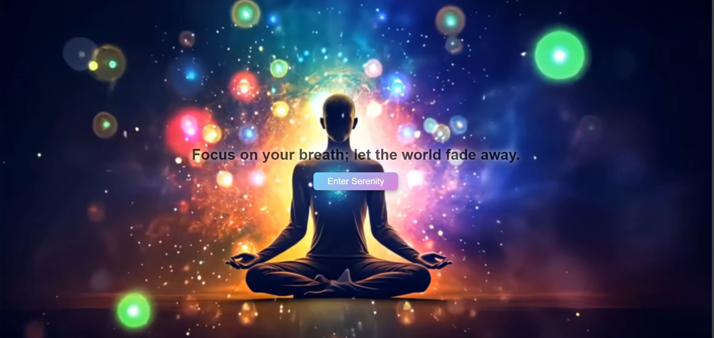
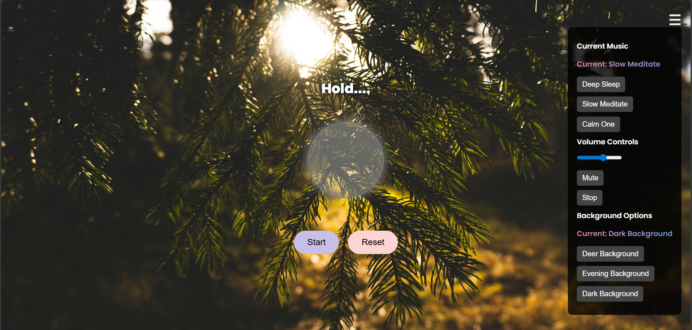

# 🌿 Serenity Breath Web

> A calming and interactive breathing meditation website to help you relax, reset, and restore your inner peace.

---

## 🌸 Live Demo

🔗 [View Live Project](https://your-live-link.com)  
📁 [Explore the Repository](https://github.com/khushi05sharma/serenity-breath-web.git)

---

## 📌 Table of Contents

1. [🧘‍♀️ About the Project](#about-the-project)
2. [🌟 Features](#features)
3. [🖼️ Screenshots](#screenshots)
4. [🛠️ Tech Stack](#tech-stack)
5. [⚙️ Installation](#installation)
6. [🚀 Usage](#usage)
7. [🌱 Future Enhancements](#future-enhancements)
8. [📜 License](#license)
9. [📬 Contact](#contact)


---

## 🧘‍♀️ About the Project

**Serenity Breath Web** is a mindful web application designed to guide users through a calming breathing routine, accompanied by peaceful visuals and ambient music.  
Built with love using **HTML**, **CSS**, and **Vanilla JavaScript**, this project merges beautiful UI design with real-time interactivity to enhance emotional well-being 🌬️💖

---

## 🌟 Features

✅ Animated breathing guide (Inhale → Hold → Exhale)  
✅ Motivational quotes that auto-update every few seconds  
✅ Soft blurred full-screen video background  
✅ Meditation music selection with volume, mute, and stop controls  
✅ Background customization with preview  
✅ Mobile-responsive and accessible  
✅ Smooth animations and intuitive UI/UX

---

## 🖼️ Screenshots

> Replace these with your own project screenshots

| Landing Page | Breathing Page |
|--------------|----------------|
|  |  | 

---

## 🛠️ Tech Stack

| Category | Tools Used |
|---------|------------|
| 💻 Frontend | HTML5, CSS3, JavaScript |
| 🎨 Fonts | Google Fonts (Poppins, Lora, Playfair, etc.) |
| 🎵 Audio | HTML5 `<audio>` API |
| 🎬 Animation | CSS keyframes, transitions |
| 📱 Responsiveness | CSS media queries |

---

## 🚀 Usage

Click on “Enter Serenity” to begin your journey.

Choose music and background using the ☰ menu.

Follow the breathing circle and instructions.

Use Reset or Stop anytime to pause.

---

## 🌱 Future Enhancements

 Add breathing session timer (2 min, 5 min, etc.)

 Save user preferences using localStorage

 Improve mobile gestures (swipe for menu)

 Add dark/light theme toggle

 Convert project to React + TypeScript version


---

## 📜 License 

This project is licensed under the MIT License– feel free to use, modify, and distribute!
See the LICENSE file for more details.

---

## ⚙️ Installation

### Steps

```bash
# 1. Clone the repository
git clone https://github.com/khushi05sharma/serenity-breath-web.git

# 2. Navigate into the project folder
cd serenity-breath-web

# 3. Open the project in your browser
# Simply double-click index.html or run using Live Server in VS Code


